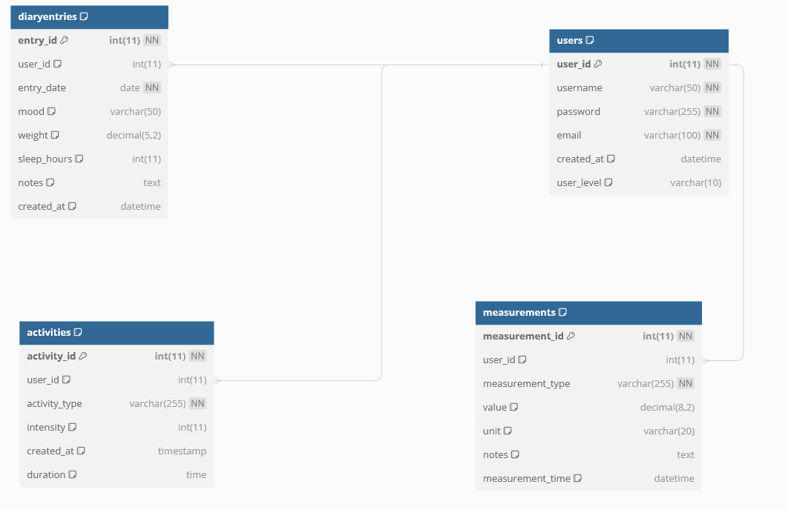

# Hyte web dev back-end server

**Node.js + Express** application.

(Check weekly branches too.)

## Usage

1. Clone/download code
2. Run `npm i` inside project folder
3. Install & start MySQL/MariaDB server
4. Import database script(s) in `db/` folder
5. Create `.env` file based on `.env.sample`
6. Start the dev server: `npm run dev` / `npm start`

## Project

> [!NOTE]
> - [Click here](https://jerek.norwayeast.cloudapp.azure.com/) to try out the functionalities directly on the website.
> - You can find the FrontEnd code [here](https://github.com/jerekarp/hyte-frontend)
> - [Online API-documentation](https://jerek.norwayeast.cloudapp.azure.com/docs/)


## Functionalities:

- **Responsive** - The website's CSS definitions have been crafted with responsive design in mind, ensuring smooth functionality on smartphones through the use of media queries.

- **User Arrival**: When a user arrives at the site, they have the option to either log in or create a new account by clicking the "Don't have an account? Create one" link. For security reasons, the password must be entered twice during registration.

- **Logging In**: If an incorrect username or password is entered, an error message appears on the login form.

- **Successful Login**: Upon successful login, a notification appears above the login form indicating the successful login.

- **Navigating to Home**: The user is directed to the home page (home.html), where a personalized greeting message based on the time of day appears in the center of the screen. In the navigation bar, next to the LogOut button, the username of the logged-in user is displayed.

- **Health Diary**: On the Health Diary (home.html) page, the user can view their own diary entries, activities, and measurements. If the user has no entries and attempts to retrieve them, a notification appears in the table.

- **Adding New Information**: The user can add new diary entries, activities, and measurements by selecting the desired option from the "Select an option" menu and see notification after adding them.

- **Profile & Users**: On the profile page (profile.html), the user can search for all users and view their information by clicking the "Info" button or delete their own data by clicking the "Delete" button. If a non-administrator attempts to delete another user's data, they will receive a notification.

- **Updating Information**: On the Profile & Users page, the user can also update their own information, such as username, password, or email address. The updated information will also be reflected in the list of all users.

- **About Page**: On the About page (about.html), the user sees an animated introduction image with a parallax effect added.

- **Logging Out**: The user can log out at any time by clicking the "Log Out" button in the top right corner.


## Pictures from website interface:
Frontpage:


HealthDiary (home.html):


Profile & Users (profile.html):
[Profile and Users Image](https://i.imgur.com/4u2fv8l.png)

About (about.html) 1/2:
[About 1/2 Image](https://i.imgur.com/HnredVT.png)

About 2/2 (after parallax hero):
[About 2/2 Image](https://i.imgur.com/KivMk9q.png)


## Database Structure:




### Users Table
- **user_id**: Unique identifier for each user (auto-incremented).
- **username**: Username of the user (unique).
- **password**: Password of the user.
- **email**: Email address of the user (unique).
- **created_at**: Timestamp indicating when the user account was created.
- **user_level**: User's level, default set to 'regular'.

### measurements Table
- **measurement_id**: Unique identifier for each measurement (auto-incremented).
- **user_id**: Identifier linking the measurement to a specific user.
- **measurement_type**: Type of measurement recorded.
- **value**: Value of the measurement.
- **unit**: Unit of measurement.
- **notes**: Additional notes or comments.
- **measurement_time**: Timestamp indicating when the measurement was taken.

### activities Table
- **activity_id**: Unique identifier for each activity (auto-incremented).
- **user_id**: Identifier linking the activity to a specific user.
- **activity_type**: Type of activity performed.
- **intensity**: Intensity level of the activity.
- **created_at**: Timestamp indicating when the activity was recorded.
- **duration**: Duration of the activity.

### diaryentries Table
- **entry_id**: Unique identifier for each diary entry (auto-incremented).
- **user_id**: Identifier linking the entry to a specific user.
- **entry_date**: Date of the entry.
- **mood**: Mood of the user.
- **weight**: Weight of the user.
- **sleep_hours**: Number of hours slept.
- **notes**: Additional notes or comments.
- **created_at**: Timestamp indicating when the entry was recorded.


## Resources and endpoints

> [!NOTE]
> These details are also available in the API-documentation (see the link above)


### `/items` (works with hard-coded mock data only, no need for db)

```http
GET http://127.0.0.1:3000/items
GET http://127.0.0.1:3000/items/:id
DELETE http://127.0.0.1:3000/items/:id

POST http://127.0.0.1:3000/items
content-type: application/json
body: {"name": "New Item"}
```

### `/api/auth`

# Login
```http
POST http://localhost:3000/api/auth/login
content-type: application/json

{
  "username": "user",
  "password": "secret"
}

```

### `/api/users`

Example queries:

```http
# Get all users (requires token)
GET http://127.0.0.1:3000/api/users

# Get user by id (requires token)
GET http://127.0.0.1:3000/api/users/:id

# Delete user (requires token)
DELETE http://127.0.0.1:3000/api/users/:id

# Create user
POST http://127.0.0.1:3000/api/users
content-type: application/json

{
  "username": "testuser",
  "password": "testpassword",
  "email": "test@example.com"
}

# Update user's own data (requires token)
PUT http://127.0.0.1:3000/api/users/
content-type: application/json

{
  "username": "testuser",
  "password": "testpassword55",
  "email": "test@example.com"
}


```

### `/api/entries`

Example queries:

```http
# Get all entries for a logged in user (requires token)
GET http://localhost:3000/api/entries

# Get entries by id (requires token)
GET http://localhost:3000/api/entries/:id

# Post entry (requires token)
POST http://localhost:3000/api/entries
content-type: application/json

{
  "entry_date": "2024-02-12",
  "mood": "Happy",
  "weight": 69.6,
  "sleep_hours": 7,
  "notes": "This was a good day",
  "user_id": 3
}

# Update entry (requires token)
PUT http://localhost:3000/api/entries/:id
content-type: application/json

{
  "entry_date": "2024-02-12",
  "mood": "Even more happy now",
  "weight": 69.6,
  "sleep_hours": 7,
  "notes": "This was a good day"
}

# Delete entry (requires token)
DELETE http://localhost:3000/api/entries/:id
```

### `/api/activities`

Example queries:

```http
# Get all activities for a logged in user (requires token)
GET http://localhost:3000/api/activities

# Get activities by id (requires token)
GET http://localhost:3000/api/activities/:id

# Post activity (requires token)
POST http://localhost:3000/api/activities
content-type: application/json

{
    "activity_type": "Swimming",
    "intensity": 8,
    "duration": "01:15:00",
    "user_id": 16
}

# Update activity (requires token)
PUT http://localhost:3000/api/activities/:id
content-type: application/json

{
  "activity_type": "Swimming",
  "intensity": 8,
  "duration": "01:16:00"
}

# Delete activity (requires token)
DELETE http://localhost:3000/api/activities/:id
```

### `/api/measurements`

Example queries:

```http
# Get all measurements for a logged in user (requires token)
GET http://localhost:3000/api/measurements

# Get measurements by id (requires token)
GET http://localhost:3000/api/measurements/:id

# Post measurement (requires token)
POST http://localhost:3000/api/measurements
content-type: application/json

{
  "measurement_type": "Blood Pressure",
  "value": 130,
  "unit": "mmHg",
  "notes": "Normal"
}

# Update measurement (requires token)
PUT http://localhost:3000/api/measurements/:id
content-type: application/json

{
  "measurement_type": "Blood Pressure",
  "value": 136,
  "unit": "mmHg",
  "notes": "Fasting"
}

# Delete measurement (requires token)
DELETE http://localhost:3000/api/measurements/:id
```
